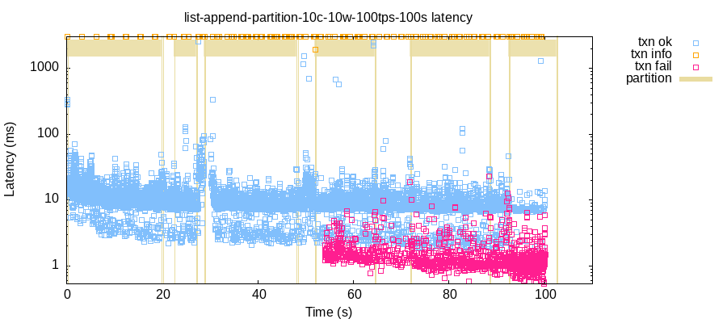
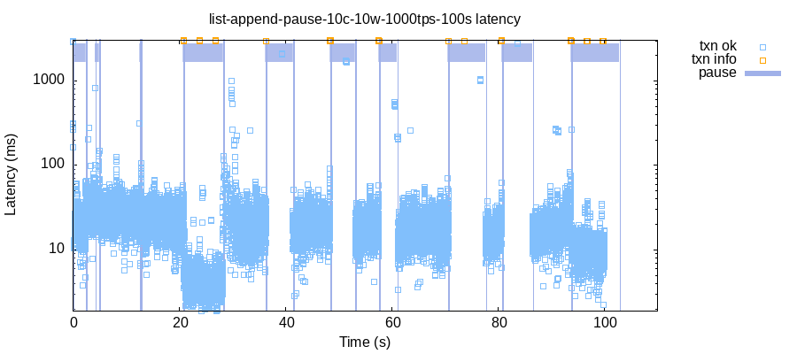
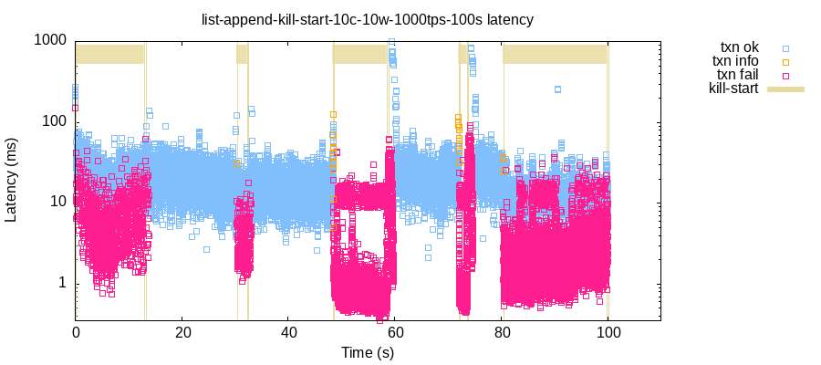

# Jepsen Tests for SpacetimeDB

Why SpacetimeDB?

- interesting architecture
- distributed sync
- dynamic community
- developers are responsive to interactions

SpacetimeDB's recent release of its version 2 has attracted attention and generated some questions around its and other databases' consistency models, isolation levels and durability.

Jepsen was purpose built to test these database properties. Lets develop a suite of Jepsen Tests for SpacetimeDB to see what we can learn, and hopefully contribute back to the project.

----

## Keyed Append Only List

Using a keyed append only list as a data model will give Jepsen's checker, Elle, the best chance to find the most anomalies.

### Schema

```typescript
const lists = table(
  {
    name: 'lists',
    public: true
  },
  {
    key: KEY.primaryKey(),
    list: LIST,
  }
);
```

### Transactions

Jepsen will generate transactions consisting of random writes/reads of random keys. Typically we use an exponential key distribution to emphasis potential conflicts between concurrent transactions.

Sample of a transaction from a Jepsen Test generator showing:

```clj
;; list with a key of 1
[[:r 1 nil]    ;; starts out empty, nil
 [:append 1 1] ;; append 1 to the end
 [:append 1 2] ;; append 2 to the end
 [:r 1 [1 2]]] ;; reading our writes :)
```

Note that by using an append only list, every read will/should reflect a complete ordered history of all writes to that object, in our case the table row with the indexed key.

### Transactions in SpacetimeDB

SpacetimeDB is architected for all writes to happen in a transaction in a function that's executed on the server.

Reads can happen in transactions in functions executed on the server, or from local caches that are sync'd by the server.

Our initial implementation will perform the Jepsen generated transaction in a SpacetimeDB transaction
 in a Procedure that runs on the server.

```typescript
// writes(appends)
const append_list = ctx.db.lists.key.find(k);
if (append_list == null) {
  const new_list = { key: k, list: [v!] };
  ctx.db.lists.insert(new_list);
} else {
  append_list.list.push(v!);
  ctx.db.lists.key.update(append_list);
}
res.push(['append', k, v!]);

// reads
const read_list = ctx.db.lists.key.find(k);
if (read_list == null) {
  res.push(['r', k, null]);
} else {
  res.push(['r', k, read_list.list]);
}
```

----

## Correctness

As all writes are done on a single database using a single writer, no MVCC or multiple write nodes, our expectation is observe a [Strong Serializable](https://jepsen.io/consistency/models/strong-serializable) consistency model for Spacetime DB transactions.

SpacetimeDB describes itself as offering "serializable isolation", "ACID", "Atomic", and similar.

For more information on defining and testing consistency models:

- Jepsen's [Consistency Models](https://jepsen.io/consistency/models)
- [Elle: Inferring Isolation Anomalies from Experimental
Observations](https://raw.githubusercontent.com/jepsen-io/elle/master/paper/elle.pdf)

Note that we are *not* testing:

- performance
- security

----

## Nemeses

Jepsen runs the real database with real clients in a real environment and introduces real faults.

If your database is successful, e.g. adoption, lifetime, etc., it will experience environment faults.

Are they really Faults? or just Real Life? 🤔

----

### Partition

Partition the network so there's a majority of nodes on one side of the partition, and a minority on the other. Randomly select which side SpacetimeDB and client nodes are on.

```clj
;; use iptables to drop traffic 
;; from nodes on the other side of the partition
(su (exec :iptables :-A :INPUT :-s (control.net/ip src) :-j :DROP :-w))

;; heal
(su
  (exec :iptables :-F :-w)
  (exec :iptables :-X :-w))
```

#### Example of a partition test

Jepsen Test log:

```clj
;; partition a random majority of nodes
:nemesis :info :start-partition :majority
:nemesis :info :start-partition [:isolated {"n2" #{"n5" "n8" "n1" "n9" "n10" "n7"},
                                            "n5" #{"n2" "n6" "n4" "spacetimedb" "n3"},
                                            "spacetimedb" #{"n5" "n8" "n1" "n9" "n10" "n7"},
                                            ...}]

;; transactions continue to be generated

;; heal network
:nemesis :info :stop-partition nil
:nemesis :info :stop-partition :network-healed
```

- you can see when the SpacetimeDB server was partitioned away from client nodes
  - latency goes up around the partitions
  - transactions timeout
  - transactions fail



The SpacetimeDB server will disconnect clients during a partition:

```log
# client log
Connection error: ErrorEvent {
  type: 'error',
  defaultPrevented: false,
  cancelable: false,
  timeStamp: 55660.684175
}

# server log
/SpacetimeDB/crates/core/src/client/client_connection.rs websocket connection aborted for client identity `...` and database identity `...`
```

SpacetimeDB docs on [Reconnection Behavior](https://spacetimedb.com/docs/clients/connection/#reconnection-behavior):
> Current Limitation
>
>Automatic reconnection behavior is inconsistently implemented across SDKs.
> If your connection is interrupted, you may need to create a new DbConnection to re-establish connectivity.
>
> We recommend implementing reconnection logic in your application if reliable connectivity is critical.

----

### Pause/Resume

Randomly pause/resume a random set of nodes for a random duration.
Act on the SpacetimeDB or client's process with:

```clj
(cu/grepkill! :stop spacetimedb-ps-name)

(cu/grepkill! :cont spacetimedb-ps-name)
```

#### Example of a pause/resume test

Jepsen Test log:

```clj
;; pause a random subset of nodes
:nemesis :info :pause {"n3" :paused, "n4" :paused, "n7" :paused, "n8" :paused}

;; transactions continue to be generated

;; insure all nodes are resumed
:nemesis :info :resume {"n1" :resumed, ..., "n3" :resumed, ..., "spacetimedb" :resumed}
```

- you can see when SpacetimeDB server was paused/resumed
  - all transactions were paused
- `info`s are transactions that timed out due to pauses



----

### Kill/Start

Randomly kill/start a random set of nodes for a random duration.
Act on the SpacetimeDB or client's process with:

```clj
(cu/grepkill! :kill spacetimedb-ps-name)

(cu/start-daemon!
  {:chdir   jepsen-dir
   :logfile log-file
   :pidfile pid-file}
  (:binary spacetimedb-files)
  :start
  :--pg-port pg-port
  :--non-interactive)
```

#### Example of a kill/start test

Jepsen Test log:

```clj
;; kill a random subset of nodes
:nemesis :info :kill-nodes {"n10" :killed}

;; transactions continue to be generated

;; insure all nodes are started
:nemesis :info :start-nodes {"n1" :already-running, "n10" :started, ..., "spacetimedb" :already-running}
```

- you can see
  - individual client transactions fail when client node has been killed
  - all transactions fail when SpacetimeDB server has been killed



----

## GitHub Actions

- `list-append`
  
  - keyed append only list
  - all writes and reads in a transaction in a Procedure on the SpacetimeDB server
  - no environmental faults

- `list-append-kill`
  
  - `list-append` with
  - kill/start nemesis

- `list-append-pause`
  
  - `list-append` with
  - pause/resume nemesis

----

## Issues

### False Errors

A no fault environment will still produce psychosomatic, the write actually does happen, error messages.

Likely a reintroduction of [TS Client: "ERROR: Negative reference count for row", and "ERROR: Updating a row that was not present in the cache"](https://github.com/clockworklabs/SpacetimeDB/issues/2894)

Test results:

```clj
:matches ({:node "n1",
           :line "❌ ERROR Updating a row that was not present in the cache. Table: lists, RowId: 11"}
          {:node "n1",
           :line "❌ ERROR Updating a row that was not present in the cache. Table: lists, RowId: 51"}
          {:node "n1",
           :line "❌ ERROR Updating a row that was not present in the cache. Table: lists, RowId: 68"}
           ...)
```

Client log showing that key 51 did have 3 appended to it as the transaction read its own writes:

```log
[endpoint] request: body: [{"f":"append","k":51,"v":3},{"f":"r","k":51,"v":null}]
❌ ERROR Updating a row that was not present in the cache. Table: lists, RowId: 51
[endpoint] response: "{"type":"ok","value":[["append",51,3],["r",51,[1,2,3]]]}"
```
